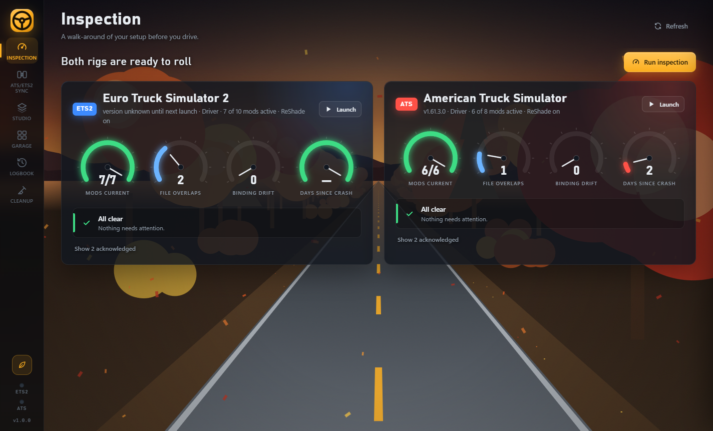
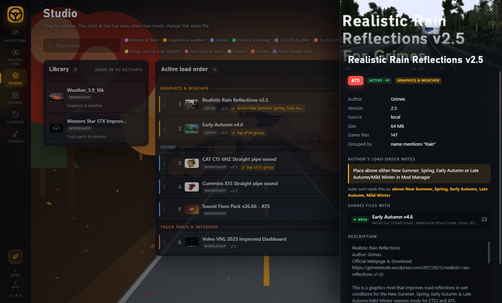
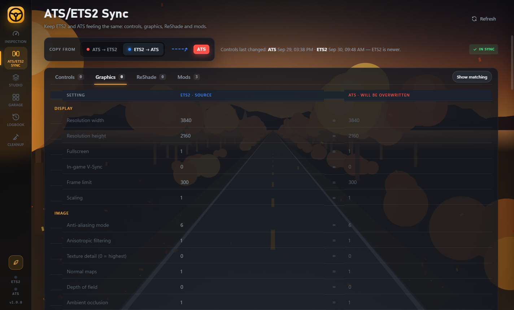
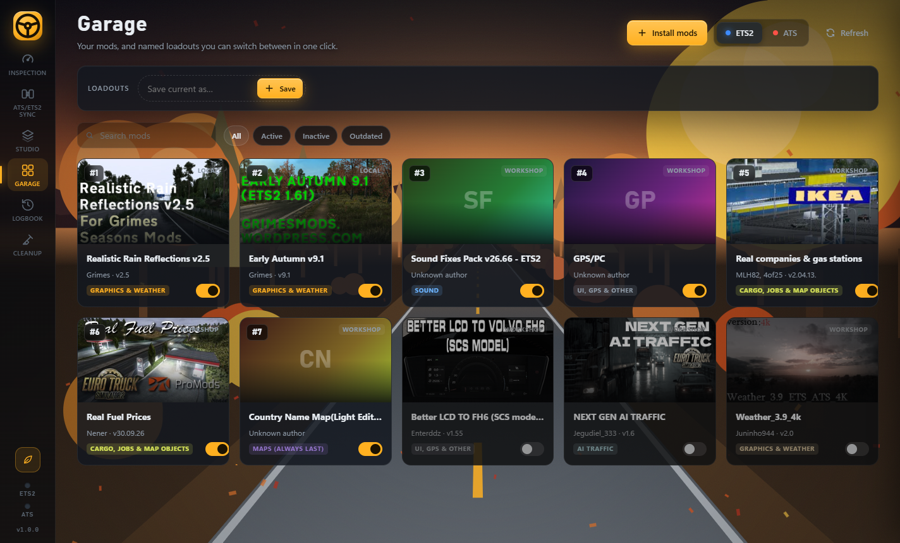
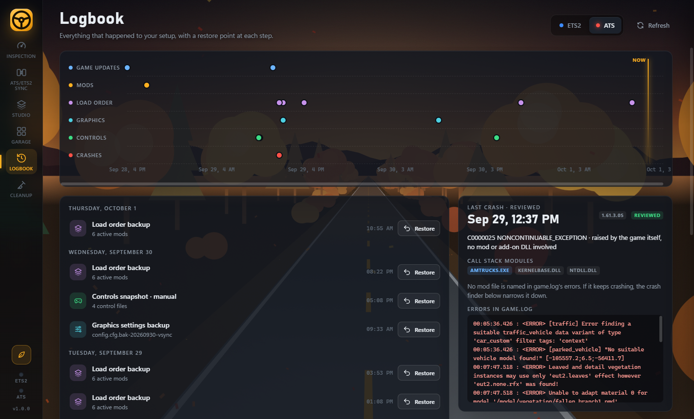
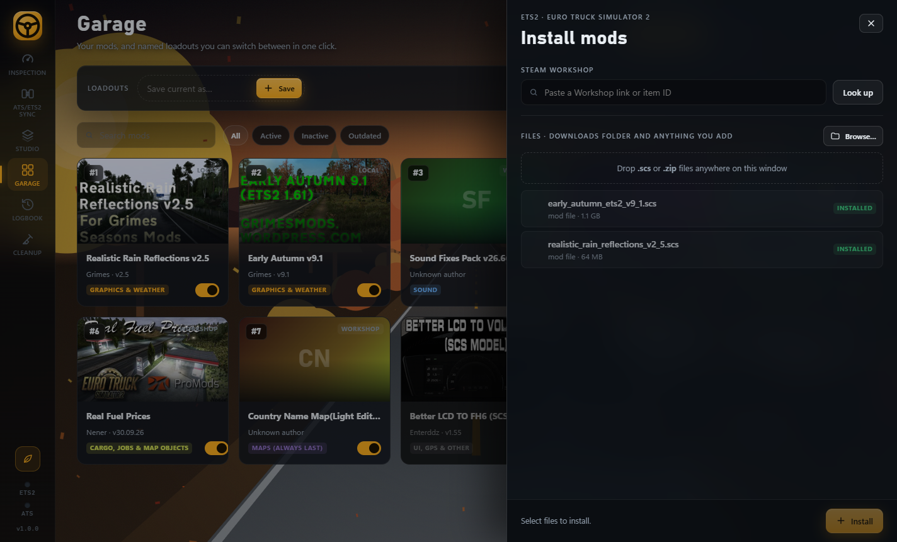

# Pre-Trip

The walk-around before you drive, for Euro Truck Simulator 2 and American Truck Simulator. A Windows app
(Python back end, HTML front end in a native window via pywebview + WebView2) that checks your setup, keeps the
two games in step, manages mod load order, and keeps a restorable history of every change.



- **Inspection** – health check with clickable gauges (mods current for the installed version, file overlaps
  between active mods, bindings changed since the last snapshot, days since the last crash) and a list of
  alerts. Every alert has one clear next step, and can be acknowledged; it comes back if anything changes.
- **ATS/ETS2 Sync** – ETS2 and ATS side by side: controls, graphics settings (`config.cfg`), ReShade files and
  preset, and matching mods. One direction switch and one Sync button. Hidden on PCs with one game.
- **Studio** – drag-and-drop load order in colored group lanes, live ▲/▼ badges for files a mod wins or
  loses to another, author notes, and an auto-sort that follows each mod author's own instructions.
- **Garage** – mod gallery using each mod's preview image, plus named loadouts.
- **Install mods** (Studio and Garage) – subscribe with a Steam Workshop link, install `.scs`/`.zip` files from
  your Downloads folder, Browse…, or drop files onto the window. Zips that only wrap `.scs` files are unpacked.
  Each mod's detail panel can remove it: local mods go to the Recycle Bin, Workshop mods are unsubscribed.
- **Logbook** – timeline of controls snapshots, load-order and graphics backups, game updates and crashes,
  each restorable. Reads `game.crash.txt`/`game.log.txt`, and a crash finder that switches half the mods off
  per round to find the one crashing the game.
- **Cleanup** – profile health, and the conflict copies cloud sync apps leave in game folders
  (`controls - Copy.sii`, `(# Name clash …)`), moved to a quarantine folder with a manifest. Nothing is deleted.

## Screenshots

| Studio: load order, author notes, file overlaps | ATS/ETS2 Sync: graphics side by side |
|---|---|
|  |  |
| **Garage: your mods and loadouts** | **Logbook: history, restore points, crash help** |
|  |  |
| **Install mods: Workshop link, Downloads, drag and drop** | |
|  | |

Every write refuses to run while the target game is open (the game rewrites its files on exit) and backs up
what it replaces first, so every change can be undone from the Logbook.

Pre-Trip is free and open source (MIT). If it saves you some headaches, you can
[☕ buy me a coffee](https://buymeacoffee.com/xx.r0ger.xx). Entirely optional, never required.

## Download and run

1. Download **Pre-Trip.exe** from the [latest release](../../releases/latest). No installer and no Python needed.
2. Run it. Windows 10 and 11 already include the WebView2 runtime it uses.
3. The first time, Windows SmartScreen may say *"Windows protected your PC"*, because the exe isn't code-signed
   (signing certificates cost money and Pre-Trip is free). Click **More info → Run anyway**. Some antivirus tools
   are wary of packaged Python apps for the same reason; the full source is here if you'd rather build it yourself.

Close the game before saving changes in Pre-Trip: the games rewrite their files when they exit, and Pre-Trip refuses
to write while a game is running.

## Run from source / build the exe

```
pip install -r requirements.txt
pythonw webapp.pyw        # run
python build.py           # build dist\Pre-Trip.exe
```

Set `PRETRIP_GAMES=ets2` (or `ats`) to preview the one-game experience on a PC that has both. `PRETRIP_TEST=1` opens the window off-screen under a different title, for automated checks.

Tests: `python -m unittest discover -s tests`

## Where things are stored

`%USERPROFILE%\Documents\TruckSim-Configs` – controls snapshots, profile backups, loadouts, acknowledged
alerts, crash-finder state and caches. (The folder keeps its original name so existing snapshots carry over.)

## Classic app

`app.pyw` is the original tkinter app (bindings snapshots and compare, mods list, installs, cleanup of
cloud-sync leftovers). Everything it does is now in Pre-Trip; it still works with no extra dependencies but isn't getting new features.

```
pythonw app.pyw
```

## Notes

- Profiles are found under the Windows *Documents* folder (wherever it is redirected, e.g. Proton Drive):
  `<Documents>\<Game>\steam_profiles\*` and `...\profiles\*`. Steam Cloud profiles keep `profile.sii`
  (the mod load order) in `Steam\userdata\<id>\<appid>\remote\profiles\`.
- Keep game profiles out of live cloud sync if you can: sync clients racing the game produce
  "Name clash" / conflict copies and can revert bindings.
- Not affiliated with SCS Software. Euro Truck Simulator 2 and American Truck Simulator are their trademarks.
- MIT licensed, see [LICENSE](LICENSE).
